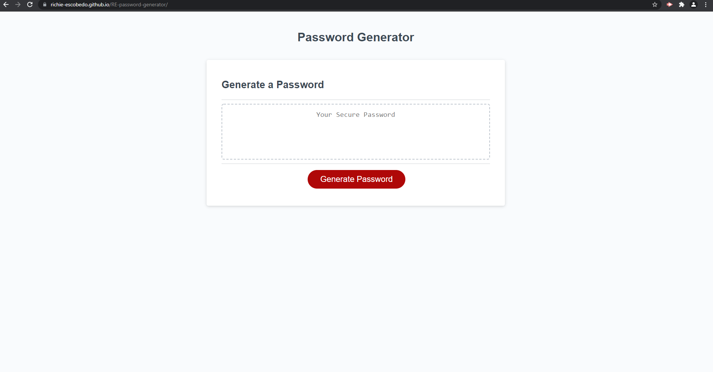

# RE-password-generator

## Description
Application that generates a random password based on the user's preference. The application provides a criteria for the user to go through in order to produce the password. The application is based off HTML and CSS and powered by JavaSCript. Lastly, the app is responsive and adheres to different screen sizes.

## Screenshot of Deployed Application

## Link to Deployed Application
[Launch Password Generator](https://richie-escobedo.github.io/RE-password-generator/) 
